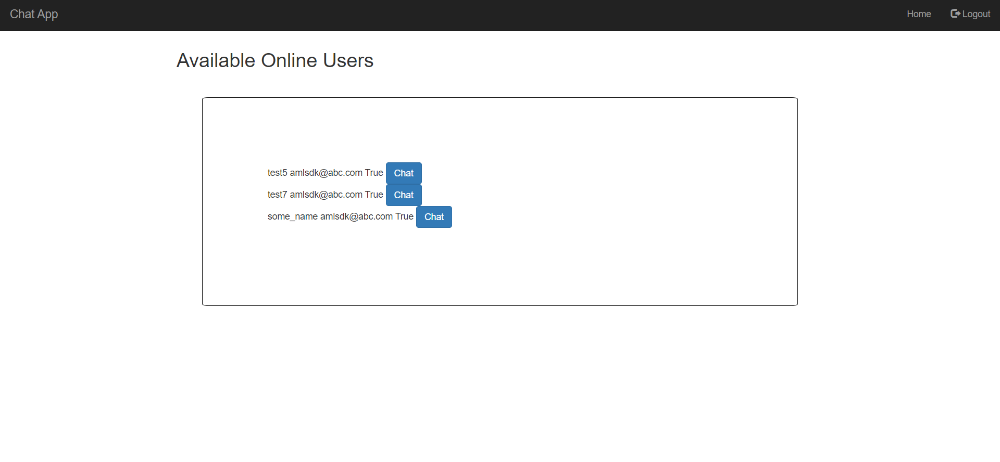

# django_chat
chat app for NeoFi Assessment




## Python packages
These packages need to be installed in order to run the service
- django
- channels
- django-crispy-forms
- crispy-bootstrap4

You have to install these packages using pip as 
```
pip install django channels django-crispy-forms crispy-bootstrap4

```


## Creating Database

```
cd project1
python manage.py makemigrations
python manage.py migrate --run-syncdb
```


## Running the Server
```
cd project1
python manage.py runserver
```


## Browser
Start your browser and hit
```
localhost:8000/api/login
```
